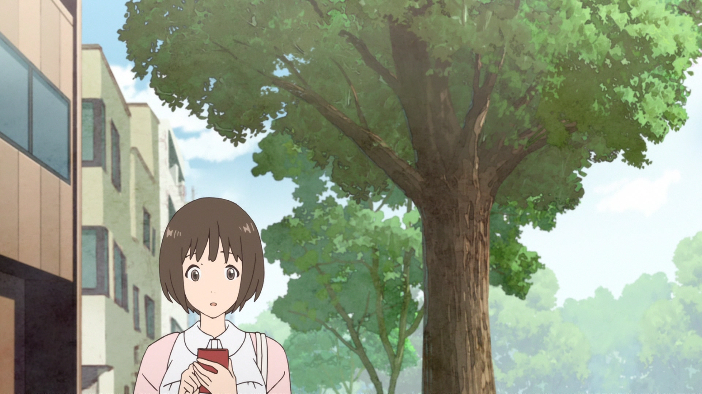

# フラグタイム 时光沙漏
> 如果能暂停时间三分钟，你会做什么？

一个人是社交恐惧，另一个人希望展现自己，这是属于她们两人的故事。

## 基本信息

- 日文：フラグタイム
- 译名：时光沙漏 / Frag-time
- 改编类型：漫画 --> 剧场版（1小时）
- 放送日期：2019-11-22
- 集数：1 [1080P HEVC下载](http://49.234.223.102:5555/video/[KTXP][Fragtime][MOVIE][GB][1080p][BDrip][HEVC][FLAC].mkv)

### STAFF
- 原作: さと（秋田书店）
- 导演、脚本、音响监督：佐藤卓哉（命运石之门、牵牛花与加濑同学、选择感染者WIXOSS）
- 人物设计、总作画监督：须藤智子（牵牛花与加濑同学、宅男腐女恋爱真难OVA）
- 美术监督: 本多敬
- 动画制作：ティアスタジオ（为什么老师会在这里！？）（本作上映后半个月就跑路了😂）

另外，担任色彩设计的岩井田洋也出任了*牵牛花与加濑同学*的色彩设计，怪不得官网写着***《牵牛花与加濑同学》staff赠与的最新作***，不过确实有呐味（尤其是街道和天空背景的美术风格）。

### CAST
- **森谷美玲**：伊藤美来

- **村上遥**：宫本侑芽

- 小林由香利：安济知佳

miku不用说了，可爱。

宫本侑芽的配音一开始就有点*SSS.古利特*里的多宝六花的感觉，村上和六花的形象都是有点瑟瑟的（两者我都很喜欢（在说啥呢）），六花就是实打实的JK，村上的那种不所谓😶的形象表现得很好。

## 剧情&角色

*纯爱百合片*

1天1次，能够暂停三分钟时间的女高中生--森谷美玲，不擅长于人交流的她，在某一天时间暂停的时候，偷看了美少女村上遥的裙底，但不知为何时间暂停对村上失效了，这个秘密因此暴露。作为道歉，深谷答应完成村上的任何愿望...

!> **以下部分涉及剧透！**若不想观看，可跳转至[下一章节](anime/Fragtime?id=作画)

*** 
村上说第二天再告诉森谷要做什么。

第二天，深谷在被小林搭话的时候用时间暂停逃走了，村上追了上来，在一番对话中有“原来是喜欢我啊”、“是想和我分享相同的时间啊”的话，并约定周日两人去约会。

周日，两人去约会的时候，看到了村上名义上的男友在和别的女孩子约会，村上表现得“就这样吧”的感觉，当她准备离开的时候，时间暂停了。回过头来发现森谷已经把一条内裤套在了男友头上，并拿出了口红准备在他脸上涂鸦，后来那个男生约会时头戴胖次的事便传开了。

在那次约会之后，森谷和村上便经常在课上暂停时间，村上在这些时间里做出一些不像是她做的事，比如在同学的笔记上写一些秘密之类。有一次，村上站到了课桌上，脱下衣服丢在了老师和同学头上，并让森谷拍照纪念，森谷看得入迷（*橘势良好*）。可是，随着一次次的暂停，森谷发现自己控制时间暂停的能力慢慢减弱了...

村上邀请森谷到自己房间，色诱森谷，亲亲之后深谷很疑惑，认为**这不是村上想做的事情**，并质问她为什么要这么做。村上没有鸟她，开始脱衣服（*我最期待的画面出现了.jpg*），回答“因为森谷同学看起来想我这么做嘛”。然后村上因为老妈而穿上衣服离开房间，离开的时候还叮嘱千万不要乱看哦，尤其是**床底**。此地无银，正常人肯定是选择康康啊！

全是小卡片订成的册子，每张卡片正面写的是学校里同学和老师的名字，反面则是对应的兴趣爱好。村上解释说，她平时就去了解每个人的喜好，**积极响应大家的请求**，就是为了维持这些虚伪的朋友关系；她也知道有一些人在背后中伤她，传一些有的没的，但即便如此还是选择笑脸相迎。

森谷表示不理解，难道你就没有想做的事吗？村上拿起写着自己名字的卡片，翻过面来，一片空白。

后面就在一次上课的时候时间暂停，村上站在了课桌上，森谷也站在了课桌上，告诉她“现在时间没有停止”，然后告诉全班人自己和村上的所作所为。村上跑了出去，可惜没跑得过森谷，被扑到在走廊上，被一顿嘴炮输出“你做那些事，其实是想**展现自己**，是想大家**了解真正的自己**”（大概是这个意思）。

全剧终。

## 作画

不精细（人物勾线好粗），但比较稳定，对于我个人来说，比较喜欢的是街道和天空的那种水彩（大概）背景美术风格，*牵牛花*也是这种风格，但在这部里面其他场景的就是普通的风格了。

我看过的、药效强劲的百合番就只有*利兹与青鸟*、*牵牛花*，发现这几部共同的特点就是用女孩子**细微的动作描写**来表现她们的情感，比如...好吧，没有比如，因为印象不深，光顾着看村上的肉体了。

村上这个发型这个穿搭我好爱。

## 音乐

主题曲：[fragile - 伊藤美来 / 宮本侑芽](https://music.163.com/#/song?id=1404713784)

抒情风，声音好温柔，爱了。

bgm那些没注意（土下座.jpg）

## 总结

人物设定和作画很OK啦，但是剧情平平淡淡，也就最后的对吼有、意思，不建议看（还不如去看*牵牛花*（不是））。